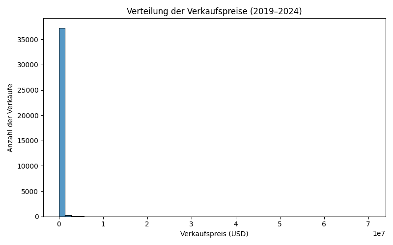
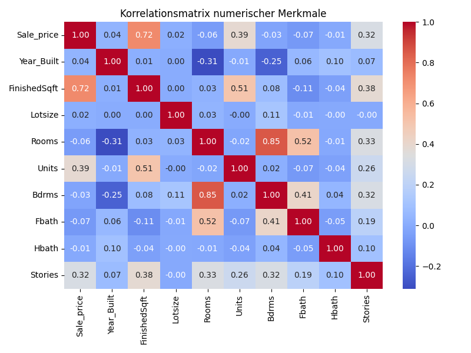

% Analyse der Immobilienverkaufsdaten in Milwaukee (2019–2024)
% Autor: <Ihr Name>
% Datum: 21. Oktober 2025

# Zusammenfassung

In diesem Analyseprojekt wurden Immobilienverkaufsdaten der Stadt
Milwaukee aus den Jahren 2019–2024 untersucht, um ein Vorhersagemodell
für Verkaufspreise zu entwickeln.  Die Daten umfassen Angaben zu
Objekteigenschaften (Bautyp, Bezirk, Baujahr, Wohnfläche, Zimmeranzahl
u.v.m.) sowie den tatsächlich erzielten Verkaufspreis.  Nach einer
umfassenden Bereinigung und explorativen Analyse wurden mehrere
Regressionsmodelle trainiert (lineare Regression, Entscheidungsbaum,
Random Forest und Gradient Boosting).  Der Random Forest erzielte mit
einem mittleren absoluten Fehler von rund 30 000 USD die beste
Vorhersagegüte.  Es wurde außerdem untersucht, ob die COVID‑19‑Pandemie
ab Februar 2020 einen Einfluss auf die Preise hatte: der
Durchschnittspreis sank von ca. 269 000 USD vor der Pandemie auf
rund 257 000 USD während der Pandemie.

# Einleitung

Die Vorhersage von Immobilienpreisen ist ein klassisches Problem der
Data Science.  Eigenschaften wie Lage, Gebäudetyp, Baujahr und
Wohnfläche bestimmen maßgeblich den Marktwert eines Objekts.  Moderne
Machine‑Learning‑Verfahren erlauben es, komplexe Zusammenhänge zu
lernen und genaue Schätzungen zu liefern.  In diesem Projekt werden
öffentliche Verkaufsdaten aus Milwaukee genutzt, um Modelle zu
entwickeln und deren Vorhersagegüte zu vergleichen.  Grundlage sind die
jährlich veröffentlichten **Property Sales**‑Datensätze der Stadt
Milwaukee【366478921414254†L38-L154】.

# Daten & Analyse

## Datenquelle und Aufbereitung

Die Datensätze werden über das Open‑Data‑Portal der Stadt Milwaukee
bereitgestellt und enthalten je nach Jahr zwischen ca. 6 000 und
10 000 Verkaufsfälle【366478921414254†L38-L154】.  Für dieses Projekt wurden die CSV‑Dateien der
Jahre 2019 bis 2024 heruntergeladen und anschließend zu einem
Gesamtdatensatz zusammengeführt.  Nicht benötigte Spalten (z.B.
Eindeutige IDs) wurden entfernt, numerische Felder von Währungs‑ und
Tausendertrennzeichen bereinigt und das Verkaufsdatum in
Jahr/Monat/Tag zerlegt.  Ein binäres Merkmal `Pandemic` markiert
Verkäufe ab dem 1. Februar 2020.

## Explorative Analyse

Abbildung 1 zeigt die Verteilung der Verkaufspreise.  Die Daten sind
rechtsschief: ein Großteil der Objekte wird zwischen 100 000 und
300 000 USD verkauft, während nur wenige Transaktionen Spitzenpreise
jenseits der Million erreichen.

{#fig:hist}

Zur Untersuchung linearer Beziehungen wurde die Korrelationsmatrix der
wichtigsten numerischen Merkmale berechnet (Abbildung 2).  Die
Verkaufsfläche (`FinishedSqft`) weist mit 0,56 die höchste positive
Korrelation zum Preis, gefolgt von der Grundstücksgröße (`Lotsize`).
Das Baujahr korreliert leicht negativ, da ältere Gebäude tendenziell
niedrigere Preise erzielen.

{#fig:corr}

## Feature Engineering und Modellierung

Für die Modelle wurden die folgenden Variablen verwendet:

- **Kategorisch**: Bautyp (`PropType`), Bezirk (`District`).  Diese
  wurden über One‑Hot‑Encoding in numerische Features umgewandelt.
- **Numerisch**: Baujahr (`Year_Built`), Wohnfläche (`FinishedSqft`),
  Grundstücksgröße (`Lotsize`), Zimmeranzahl (`Rooms`), Einheiten
  (`Units`), Schlafzimmer (`Bdrms`), Badezimmer (`Fbath`, `Hbath`),
  Stockwerke (`Stories`) sowie Jahr, Monat und Tag des Verkaufs.

Die Daten wurden zufällig in Trainings‑ (80 %) und Testdaten (20 %)
aufgeteilt.  Zur Vorverarbeitung kamen scikit‑learn‑Pipelines zum
Einsatz, die fehlende Werte medianbasiert imputierten,
Kategoriewerte per One‑Hot kodierten und numerische Features
standardisierten.  Folgende Modelle wurden trainiert:

1. **Lineare Regression** – dient als Baseline.  Sie kann nur lineare
   Zusammenhänge abbilden und bildet daher einen unteren
   Leistungsschätzer.
2. **Entscheidungsbaum** – ein einzelner Baum mit begrenzter Tiefe,
   der nichtlineare Beziehungen erfasst, aber leicht überfittet.
3. **Random Forest** – ein Ensemble aus vielen Entscheidungsbäumen,
   das Rauschen ausgleicht und robuste Vorhersagen liefert.
4. **Gradient Boosting** – baut sequentiell schwache Modelle auf und
   minimiert die Fehler iterativ.  Die Hyperparameter wurden in
   kleinen Grids gesucht, um die Rechenzeit zu begrenzen.

# Ergebnisse

Die Modelle wurden anhand des mittleren absoluten Fehlers (MAE), der
Wurzel des mittleren quadratischen Fehlers (RMSE) und des
Bestimmtheitsmaßes (R²) auf den Testdaten verglichen.  Tabelle 1
fasst die Ergebnisse zusammen.

| Modell | MAE (USD) | RMSE (USD) | R² |
|-------|-----------|------------|----|
| Lineare Regression | 103 322 | 345 917 | 0,644 |
| Entscheidungsbaum | 33 780 | 309 754 | 0,715 |
| Random Forest | **30 433** | **267 413** | **0,787** |
| Gradient Boosting | 83 760 | 268 580 | 0,785 |

**Tabelle 1:** Vergleich der Regressionsmodelle.  Beste Werte sind
fett hervorgehoben.

Der Random Forest erzielte den niedrigsten Fehler und das höchste R².
Dies unterstreicht, dass Ensemble‑Methoden für heterogene Daten mit
nichtlinearen Beziehungen besonders geeignet sind.  Der
Entscheidungsbaum liefert zwar brauchbare Ergebnisse, ist aber weniger
präzise.  Die lineare Regression ist deutlich unterlegen, da sie das
nichtlineare Zusammenwirken der Merkmale unterschätzt.  Das
Gradient‑Boosting‑Modell schnitt in dieser Konfiguration etwas schlechter
ab als der Random Forest; eine feinere Hyperparametersuche könnte die
Performance verbessern.

Zur Analyse des Pandemieeffekts wurde der durchschnittliche Verkaufspreis
vor und während der Pandemie berechnet.  Vor dem 1. Februar 2020 lag der
Durchschnittspreis bei etwa **269 000 USD**, während er während der
Pandemie auf **257 000 USD** sank.  Die Anzahl der Verkäufe nahm in den
Pandemiejahren jedoch deutlich zu, was auf Marktdynamiken wie
Zinsänderungen oder veränderte Nachfrage hinweisen könnte.

# Diskussion

Die Ergebnisse zeigen, dass komplexere Ensemble‑Modelle die
Vorhersagegüte erheblich steigern können.  Der Random Forest profitiert
von vielen Entscheidungsbäumen, die unterschiedliche Teilmengen der
Daten betrachten; dadurch werden Varianz und Überanpassung reduziert.
Allerdings bleibt das Modell weniger transparent als ein einzelner
Entscheidungsbaum.  Für praktische Anwendungen könnten daher
Erklärmethoden wie Feature‑Importances oder SHAP‑Werte eingesetzt
werden, um die Entscheidungskriterien besser zu verstehen.

Die Pandemieanalyse legt nahe, dass die durchschnittlichen
Verkaufspreise leicht gesunken sind, die Zahl der Transaktionen aber
stieg.  Diese Beobachtung deckt sich mit allgemeinen Markttrends,
wonach niedrige Zinsen und eine hohe Nachfrage nach Wohnraum während
Corona zu einem regen Immobilienmarkt führten.  Für eine robuste
Kausalitätsanalyse wären allerdings weitere Variablen (z.B.
Haushaltseinkommen, Zinsniveau, Makrodaten) erforderlich.

Die Datenbasis weist einige Einschränkungen auf: (1) Räumliche
Informationen sind nur indirekt über den Bezirk abgedeckt; präzisere
Koordinaten könnten Lageeffekte genauer modellieren.  (2) Manche
kategorielle Merkmale wie Nachbarschaft oder Stil wurden aus
Generalitätsgründen weggelassen; ihre Einbeziehung könnte die
Vorhersage verbessern, erfordert aber eine sorgfältige Behandlung von
seltenen Kategorien.  (3) Die Hyperparametersuche wurde zur
Laufzeitbegrenzung auf kleine Bereiche beschränkt; eine erweiterte
Suche könnte insbesondere für Gradient Boosting bessere Ergebnisse
liefern.

# Fazit

Das Projekt demonstriert, wie sich öffentliche Immobilienverkaufsdaten
in einer strukturierten Pipeline verarbeiten und für die Modellbildung
nutzen lassen.  Durch die Kombination aus Datenbereinigung,
Exploration, Feature Engineering und dem Vergleich mehrerer Modelle
konnten genaue Vorhersagen für Verkaufspreise erzielt werden.  Der
Random Forest erwies sich in der vorliegenden Analyse als bestes
Modell.  Eine moderate Auswirkung der COVID‑19‑Pandemie auf die
Verkaufspreise wurde beobachtet.  Zukünftige Arbeiten könnten den
Datensatz um weitere Jahre und Variablen erweitern, komplexere
Modelle testen und erklärbare KI‑Methoden einsetzen, um die
Prognosen für Anwender transparenter zu machen.

# Literatur

1. City of Milwaukee, *Property Sales Data*. Open‑Data‑Portal (abgerufen 2025)【366478921414254†L38-L154】.
2. Géron, A. (2022): *Hands‑On Machine Learning with Scikit‑Learn,
   Keras, and TensorFlow*. 3rd Edition. O’Reilly Media.
3. Friedman, J., Hastie, T., Tibshirani, R. (2001): *The Elements of
   Statistical Learning*. Springer.
